# Campus Fit ERD

> 실제 구현된 Hibernate Entity 기준 (2026-03-09)

```mermaid
erDiagram

    %% ──────────────────────────────────────────
    %% 1. 회원 / 인증
    %% ──────────────────────────────────────────
    universities {
        bigint id PK
        varchar name
        varchar domain
        timestamp created_at
    }

    users {
        bigint   id              PK
        varchar  email           "UNIQUE"
        varchar  password_hash
        varchar  name
        varchar  status          "PENDING_VERIFICATION | ACTIVE | REJECTED"
        varchar  role            "USER | ADMIN"
        tinyint  marketing_agree
        timestamp created_at
        timestamp updated_at
    }

    files {
        bigint   id            PK
        bigint   uploaded_by   FK
        varchar  original_name
        varchar  stored_path
        varchar  mime_type
        bigint   size
        varchar  purpose       "STUDENT_VERIFICATION"
        timestamp created_at
    }

    student_verifications {
        bigint   id                PK
        bigint   user_id           FK
        bigint   file_id           FK
        bigint   reviewed_by       FK
        varchar  verification_type
        varchar  status            "PENDING | APPROVED | REJECTED"
        varchar  note
        varchar  reject_reason
        timestamp created_at
        timestamp updated_at
    }

    %% ──────────────────────────────────────────
    %% 2. 학사 데이터
    %% ──────────────────────────────────────────
    courses {
        bigint   id            PK
        bigint   university_id FK
        bigint   dept_id       "비FK (departments 테이블 미구현)"
        varchar  name
        int      credits
        varchar  category
        timestamp created_at
    }

    course_prerequisites {
        bigint id              PK
        bigint course_id       FK
        bigint prerequisite_course_id FK
    }

    lectures {
        bigint   id            PK
        bigint   course_id     FK
        bigint   university_id FK
        bigint   dept_id       "비FK"
        int      academic_year
        varchar  term_season   "SPRING | SUMMER | FALL | WINTER"
        varchar  professor
        varchar  room
        tinyint  is_remote
        timestamp created_at
    }

    lecture_schedules {
        bigint  id          PK
        bigint  lecture_id  FK
        varchar day_of_week "MON|TUE|WED|THU|FRI|SAT|SUN"
        time    start_time
        time    end_time
    }

    academic_calendar_events {
        bigint   id            PK
        bigint   university_id FK
        varchar  title
        date     start_date
        date     end_date
        varchar  category
        int      academic_year
        timestamp created_at
    }

    %% ──────────────────────────────────────────
    %% 3. 시간표 선호 설정
    %% ──────────────────────────────────────────
    timetable_preferences {
        bigint   id           PK
        bigint   user_id      FK
        int      academic_year
        varchar  term_season
        timestamp created_at
        timestamp updated_at
    }

    preferred_time_ranges {
        bigint  id            PK
        bigint  preference_id FK
        varchar type          "PREFERRED | AVOID"
        varchar day_of_week
        time    start_time
        time    end_time
    }

    desired_courses {
        bigint  id            PK
        bigint  preference_id FK
        bigint  course_id
        varchar raw_text
        int     priority
    }

    credit_policies {
        bigint id            PK
        bigint preference_id FK "UNIQUE"
        int    min_credits
        int    max_credits
        int    target_credits
    }

    preference_options {
        bigint   id                  PK
        bigint   preference_id       FK "UNIQUE"
        tinyint  exclude_morning
        int      allow_gaps_minutes
        int      max_days_per_week
    }

    %% ──────────────────────────────────────────
    %% 4. AI 시간표 추천
    %% ──────────────────────────────────────────
    ai_timetable_recommendations {
        bigint    id                  PK
        bigint    user_id             FK
        int       academic_year
        varchar   term_season
        text      request_params_json
        timestamp created_at
    }

    recommendation_candidates {
        bigint id                PK
        bigint recommendation_id FK
        int    rank
        int    total_credits
    }

    recommendation_candidate_lectures {
        bigint candidate_id FK
        bigint lecture_id   FK
    }

    %% ──────────────────────────────────────────
    %% 5. 시간표 확정
    %% ──────────────────────────────────────────
    timetables {
        bigint    id                       PK
        bigint    user_id                  FK
        bigint    source_recommendation_id
        int       academic_year
        varchar   term_season
        varchar   title
        varchar   status                   "DRAFT | CONFIRMED"
        timestamp created_at
        timestamp updated_at
    }

    timetable_items {
        bigint id           PK
        bigint timetable_id FK
        bigint lecture_id   FK
    }

    %% ──────────────────────────────────────────
    %% 6. 캘린더
    %% ──────────────────────────────────────────
    events {
        bigint    id          PK
        bigint    user_id     FK
        varchar   title
        varchar   category    "CLASS|ASSIGNMENT|EXAM|PERSONAL|SCHOOL|PROJECT"
        timestamp start_at
        timestamp end_at
        tinyint   all_day
        varchar   description
        timestamp remind_at
        varchar   color
        timestamp created_at
        timestamp updated_at
    }

    tasks {
        bigint    id              PK
        bigint    user_id         FK
        bigint    linked_event_id FK
        varchar   title
        varchar   status          "TODO | IN_PROGRESS | DONE"
        date      scheduled_date
        timestamp due_at
        varchar   category
        timestamp remind_at
        timestamp created_at
        timestamp updated_at
    }

    %% ──────────────────────────────────────────
    %% 관계 정의
    %% ──────────────────────────────────────────

    users ||--o{ files                          : "uploads"
    users ||--o{ student_verifications          : "submits"
    users ||--o{ student_verifications          : "reviews"
    files ||--o{ student_verifications          : "used_in"

    universities ||--o{ courses                 : "has"
    universities ||--o{ lectures                : "has"
    universities ||--o{ academic_calendar_events : "schedules"

    courses ||--o{ course_prerequisites         : "requires"
    courses ||--o{ lectures                     : "has_section"

    lectures ||--o{ lecture_schedules           : "scheduled_at"
    lectures }o--o{ recommendation_candidates   : "candidate_lectures"
    lectures ||--o{ timetable_items             : "included_in"

    users ||--o{ timetable_preferences          : "sets"
    timetable_preferences ||--o{ preferred_time_ranges : "has"
    timetable_preferences ||--o{ desired_courses       : "wants"
    timetable_preferences ||--o| credit_policies       : "has"
    timetable_preferences ||--o| preference_options    : "has"

    users ||--o{ ai_timetable_recommendations   : "requests"
    ai_timetable_recommendations ||--o{ recommendation_candidates : "generates"
    recommendation_candidates }o--o{ lectures   : "contains"

    users ||--o{ timetables                     : "owns"
    timetables ||--o{ timetable_items           : "has"

    users ||--o{ events                         : "creates"
    users ||--o{ tasks                          : "creates"
    events ||--o{ tasks                         : "linked_to"
```



## 테이블 목록 (21개)

| #   | 테이블                              | 설명             |
| --- | ----------------------------------- | ---------------- |
| 1   | `universities`                      | 대학교           |
| 2   | `users`                             | 회원             |
| 3   | `files`                             | 업로드 파일      |
| 4   | `student_verifications`             | 재학생 인증      |
| 5   | `courses`                           | 과목             |
| 6   | `course_prerequisites`              | 선수과목         |
| 7   | `lectures`                          | 강의 분반        |
| 8   | `lecture_schedules`                 | 강의 시간 슬롯   |
| 9   | `academic_calendar_events`          | 학사 일정        |
| 10  | `timetable_preferences`             | 시간표 선호 설정 |
| 11  | `preferred_time_ranges`             | 선호/기피 시간대 |
| 12  | `desired_courses`                   | 희망 수강 과목   |
| 13  | `credit_policies`                   | 학점 정책        |
| 14  | `preference_options`                | 기타 선호 옵션   |
| 15  | `ai_timetable_recommendations`      | AI 추천 요청     |
| 16  | `recommendation_candidates`         | 추천 후보 시간표 |
| 17  | `recommendation_candidate_lectures` | 후보-강의 N:M    |
| 18  | `timetables`                        | 확정 시간표      |
| 19  | `timetable_items`                   | 시간표-강의 N:M  |
| 20  | `events`                            | 개인 일정        |
| 21  | `tasks`                             | 할일(Todo)       |

## 향후 추가 예정

| 항목                                  | 설명                                  |
| ------------------------------------- | ------------------------------------- |
| `departments` 테이블                  | 현재 `dept_id`는 plain Long (FK 없음) |
| `users.university_id`                 | 소속 대학 연결 미구현                 |
| `users.service_agree / privacy_agree` | 필수 약관 동의 컬럼 미구현            |

    users ||--o| student_verifications                      : "제출"
    users ||--o{ files                                      : "업로드"
    users ||--o{ timetable_preferences                      : "설정"
    users ||--o{ timetables                                 : "보유"
    users ||--o{ ai_recommendations                         : "요청"
    users ||--o{ events                                     : "등록"
    users ||--o{ tasks                                      : "등록"

    files ||--o| student_verifications                      : "증빙"

    departments ||--o{ courses                              : "소속"
    departments ||--o{ lectures                             : "소속"

    courses ||--o{ lectures                                 : "분반"
    courses ||--o{ course_prerequisites                     : "선수조건"
    courses ||--o{ course_prerequisites                     : "선수과목"
    courses ||--o{ desired_courses                          : "희망과목"

    lectures ||--o{ lecture_schedules                       : "시간표"
    lectures ||--o{ timetable_items                         : "포함"
    lectures ||--o{ ai_recommendation_candidate_items       : "후보"

    timetable_preferences ||--o{ timetable_preference_days       : "요일"
    timetable_preferences ||--o{ timetable_preference_time_ranges : "시간대"
    timetable_preferences ||--o{ desired_courses                 : "희망과목"

    ai_recommendations ||--o{ ai_recommendation_candidates       : "후보군"
    ai_recommendation_candidates ||--o{ ai_recommendation_candidate_items : "강의목록"

    timetables }o--o| ai_recommendations                    : "기반추천"
    timetables ||--o{ timetable_items                       : "포함강의"

    events ||--o{ tasks                                     : "연결투두"

```

```
