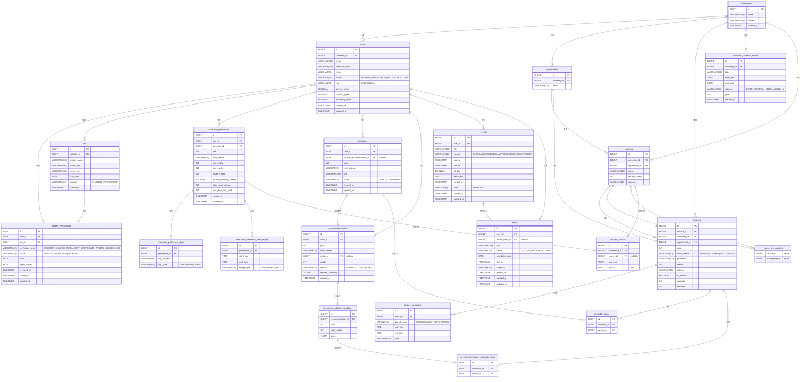

# Campus Fit ERD

```mermaid
erDiagram

    %% ──────────────────────────────────────────
    %% 1. 회원 / 인증
    %% ──────────────────────────────────────────
    universities {
        BIGINT      id               PK
        VARCHAR(100) name
        VARCHAR(200) domain
        TIMESTAMP   created_at
    }

    users {
        BIGINT      id               PK
        BIGINT      university_id    FK
        VARCHAR(254) email
        VARCHAR(255) password_hash
        VARCHAR(20)  name
        VARCHAR(30)  status          "PENDING_VERIFICATION | ACTIVE | REJECTED"
        VARCHAR(20)  role            "USER | ADMIN"
        BOOLEAN     service_agree
        BOOLEAN     privacy_agree
        BOOLEAN     marketing_agree
        TIMESTAMP   created_at
        TIMESTAMP   updated_at
    }

    files {
        BIGINT      id               PK
        BIGINT      uploader_id      FK
        VARCHAR(255) original_name
        VARCHAR(500) stored_path
        VARCHAR(100) mime_type
        BIGINT      size_bytes
        VARCHAR(30)  purpose         "STUDENT_VERIFICATION"
        TIMESTAMP   created_at
    }

    student_verifications {
        BIGINT      id               PK
        BIGINT      user_id          FK
        BIGINT      file_id          FK
        VARCHAR(40)  verification_type "STUDENT_ID_CARD | ENROLLMENT_CERTIFICATE | PORTAL_SCREENSHOT"
        VARCHAR(30)  status          "PENDING | APPROVED | REJECTED"
        TEXT        note
        TEXT        reject_reason
        TIMESTAMP   reviewed_at
        TIMESTAMP   created_at
        TIMESTAMP   updated_at
    }

    %% ──────────────────────────────────────────
    %% 2. 학사 데이터
    %% ──────────────────────────────────────────
    departments {
        BIGINT      id               PK
        BIGINT      university_id    FK
        VARCHAR(100) name
    }

    courses {
        BIGINT      id               PK
        BIGINT      university_id    FK
        BIGINT      department_id    FK
        VARCHAR(200) name
        INT         default_credits
        VARCHAR(20)  category
    }

    course_prerequisites {
        BIGINT      course_id        PK,FK
        BIGINT      prerequisite_id  PK,FK
    }

    lectures {
        BIGINT      id               PK
        BIGINT      course_id        FK
        BIGINT      university_id    FK
        BIGINT      department_id    FK
        INT         year
        VARCHAR(10)  term_season     "SPRING | SUMMER | FALL | WINTER"
        VARCHAR(100) professor
        INT         credits
        VARCHAR(20)  category
        BOOLEAN     is_remote
        INT         capacity
        INT         enrolled
    }

    lecture_schedules {
        BIGINT      id               PK
        BIGINT      lecture_id       FK
        VARCHAR(5)   day_of_week     "MON|TUE|WED|THU|FRI|SAT|SUN"
        TIME        start_time
        TIME        end_time
        VARCHAR(100) room
    }

    academic_calendar_events {
        BIGINT      id               PK
        BIGINT      university_id    FK
        VARCHAR(200) title
        DATE        start_date
        DATE        end_date
        VARCHAR(30)  category        "EXAM | VACATION | ENROLLMENT | etc"
        INT         year
        TIMESTAMP   created_at
    }

    %% ──────────────────────────────────────────
    %% 3. 시간표 선호 설정
    %% ──────────────────────────────────────────
    timetable_preferences {
        BIGINT      id               PK
        BIGINT      user_id          FK
        BIGINT      university_id    FK
        INT         year
        VARCHAR(10)  term_season
        INT         min_credits
        INT         max_credits
        INT         target_credits
        BOOLEAN     exclude_morning_classes
        INT         allow_gaps_minutes
        INT         max_days_per_week
        TIMESTAMP   created_at
        TIMESTAMP   updated_at
    }

    timetable_preference_days {
        BIGINT      id               PK
        BIGINT      preference_id    FK
        VARCHAR(5)   day_of_week
        VARCHAR(10)  day_type        "PREFERRED | AVOID"
    }

    timetable_preference_time_ranges {
        BIGINT      id               PK
        BIGINT      preference_id    FK
        TIME        start_time
        TIME        end_time
        VARCHAR(10)  range_type      "PREFERRED | AVOID"
    }

    desired_courses {
        BIGINT      id               PK
        BIGINT      preference_id    FK
        BIGINT      course_id        FK "nullable"
        TEXT        raw_text
        INT         priority         "1~5"
    }

    %% ──────────────────────────────────────────
    %% 4. AI 시간표 추천
    %% ──────────────────────────────────────────
    ai_recommendations {
        BIGINT      id               PK
        BIGINT      user_id          FK
        INT         year
        VARCHAR(10)  term_season
        BIGINT      major_id         FK "nullable"
        INT         grade
        VARCHAR(20)  status          "PENDING | DONE | FAILED"
        JSONB       request_snapshot
        TIMESTAMP   created_at
    }

    ai_recommendation_candidates {
        BIGINT      id               PK
        BIGINT      recommendation_id FK
        INT         rank
        INT         total_credits
        FLOAT       score
    }

    ai_recommendation_candidate_items {
        BIGINT      id               PK
        BIGINT      candidate_id     FK
        BIGINT      lecture_id       FK
    }

    %% ──────────────────────────────────────────
    %% 5. 시간표 (확정)
    %% ──────────────────────────────────────────
    timetables {
        BIGINT      id               PK
        BIGINT      user_id          FK
        BIGINT      source_recommendation_id FK "nullable"
        INT         year
        VARCHAR(10)  term_season
        VARCHAR(100) title
        VARCHAR(20)  status          "DRAFT | CONFIRMED"
        TIMESTAMP   created_at
        TIMESTAMP   updated_at
    }

    timetable_items {
        BIGINT      id               PK
        BIGINT      timetable_id     FK
        BIGINT      lecture_id       FK
    }

    %% ──────────────────────────────────────────
    %% 6. 캘린더 / 일정 / 투두
    %% ──────────────────────────────────────────
    events {
        BIGINT      id               PK
        BIGINT      user_id          FK
        VARCHAR(200) title
        VARCHAR(20)  category        "CLASS|ASSIGNMENT|EXAM|PERSONAL|SCHOOL|PROJECT"
        TIMESTAMP   start_at
        TIMESTAMP   end_at
        BOOLEAN     all_day
        TEXT        description
        TIMESTAMP   remind_at
        VARCHAR(7)   color           "#RRGGBB"
        TIMESTAMP   created_at
        TIMESTAMP   updated_at
    }

    tasks {
        BIGINT      id               PK
        BIGINT      user_id          FK
        BIGINT      linked_event_id  FK "nullable"
        VARCHAR(200) title
        VARCHAR(20)  status          "TODO | IN_PROGRESS | DONE"
        DATE        scheduled_date
        TIMESTAMP   due_at
        VARCHAR(30)  category
        TIMESTAMP   remind_at
        TIMESTAMP   created_at
        TIMESTAMP   updated_at
    }

    %% ──────────────────────────────────────────
    %% 관계 정의
    %% ──────────────────────────────────────────

    universities ||--o{ users                               : "소속"
    universities ||--o{ departments                         : "보유"
    universities ||--o{ lectures                            : "제공"
    universities ||--o{ academic_calendar_events            : "일정"
    universities ||--o{ courses                             : "과목"

    users ||--o| student_verifications                      : "제출"
    users ||--o{ files                                      : "업로드"
    users ||--o{ timetable_preferences                      : "설정"
    users ||--o{ timetables                                 : "보유"
    users ||--o{ ai_recommendations                         : "요청"
    users ||--o{ events                                     : "등록"
    users ||--o{ tasks                                      : "등록"

    files ||--o| student_verifications                      : "증빙"

    departments ||--o{ courses                              : "소속"
    departments ||--o{ lectures                             : "소속"

    courses ||--o{ lectures                                 : "분반"
    courses ||--o{ course_prerequisites                     : "선수조건"
    courses ||--o{ course_prerequisites                     : "선수과목"
    courses ||--o{ desired_courses                          : "희망과목"

    lectures ||--o{ lecture_schedules                       : "시간표"
    lectures ||--o{ timetable_items                         : "포함"
    lectures ||--o{ ai_recommendation_candidate_items       : "후보"

    timetable_preferences ||--o{ timetable_preference_days       : "요일"
    timetable_preferences ||--o{ timetable_preference_time_ranges : "시간대"
    timetable_preferences ||--o{ desired_courses                 : "희망과목"

    ai_recommendations ||--o{ ai_recommendation_candidates       : "후보군"
    ai_recommendation_candidates ||--o{ ai_recommendation_candidate_items : "강의목록"

    timetables }o--o| ai_recommendations                    : "기반추천"
    timetables ||--o{ timetable_items                       : "포함강의"

    events ||--o{ tasks                                     : "연결투두"
```
