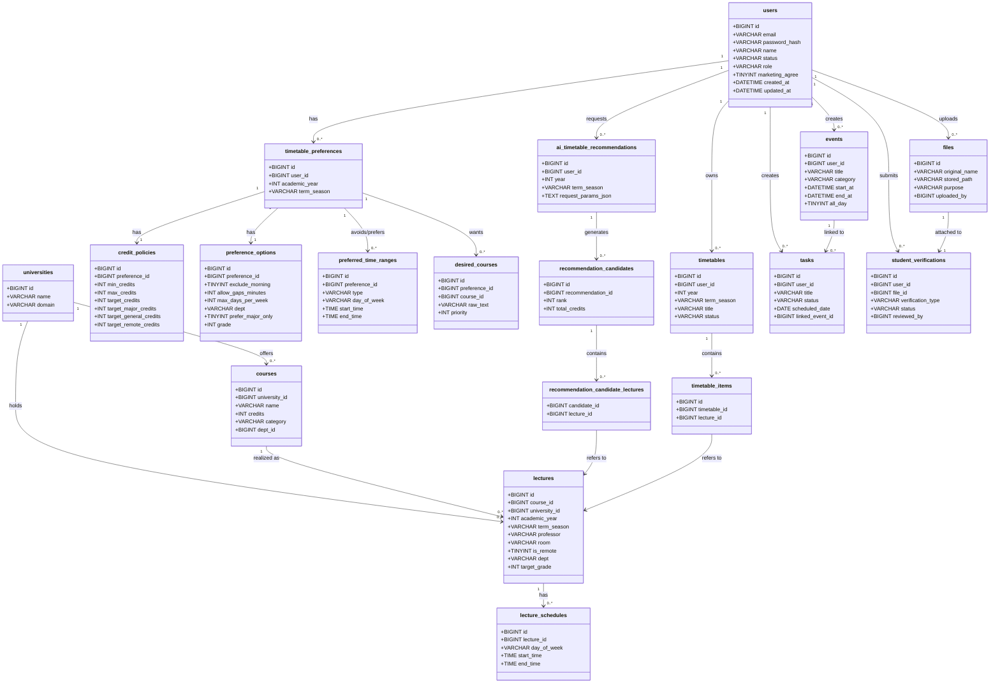
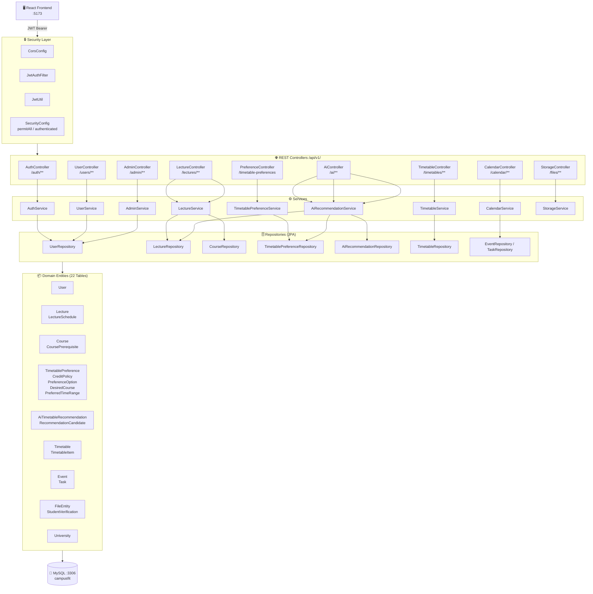
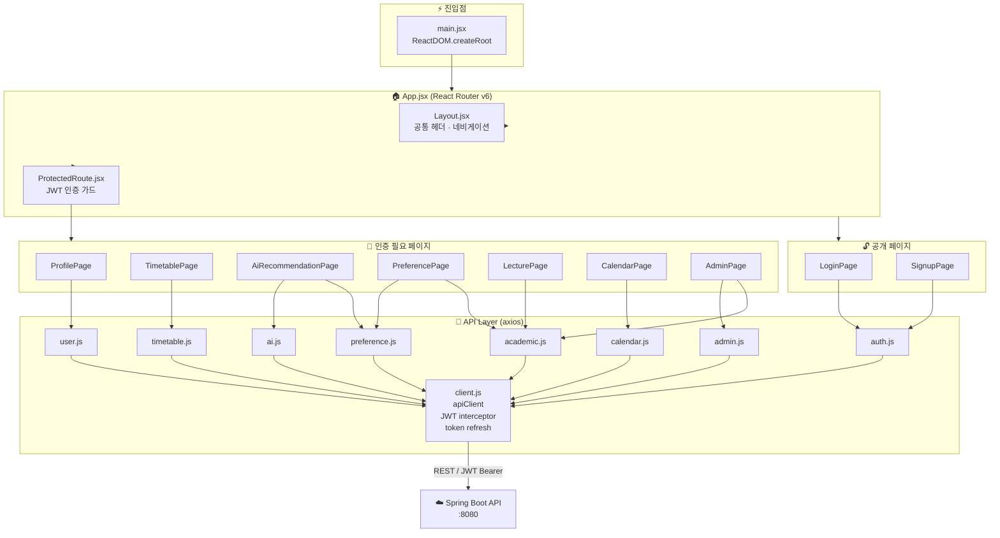
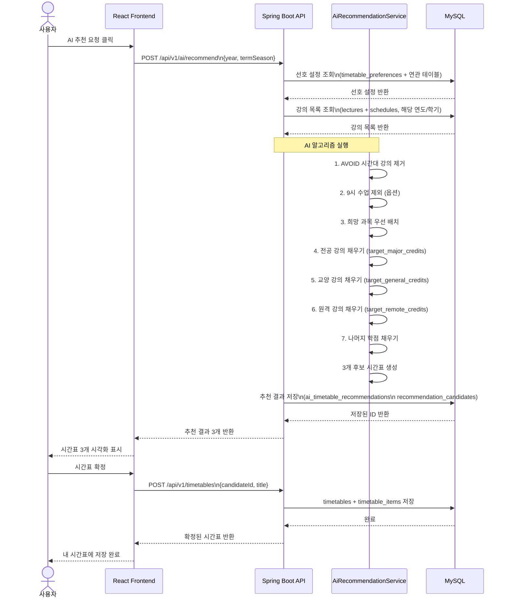
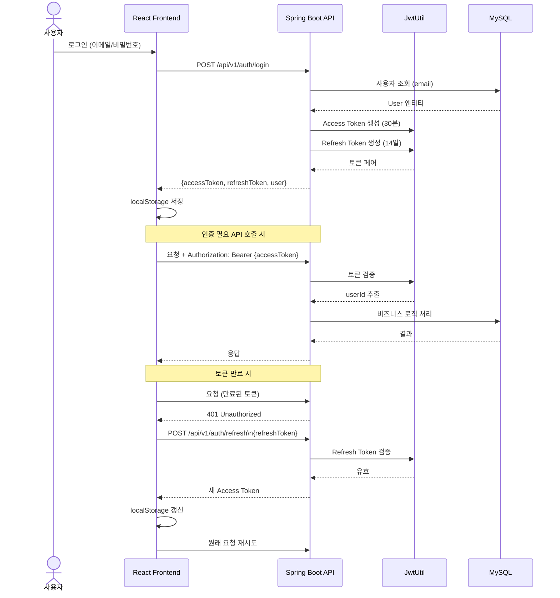
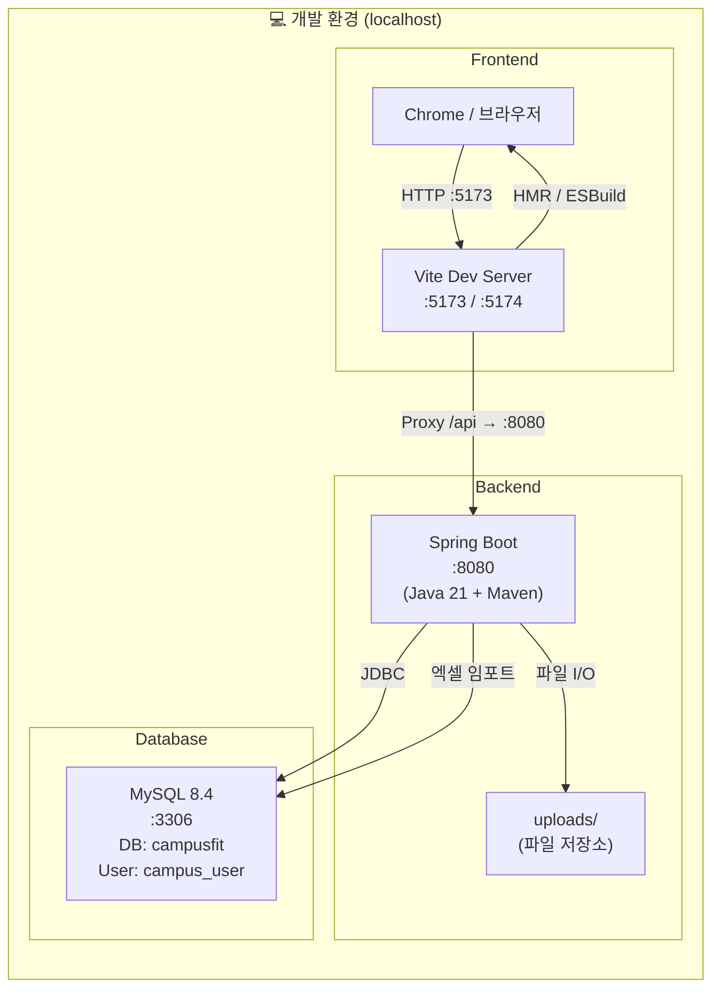
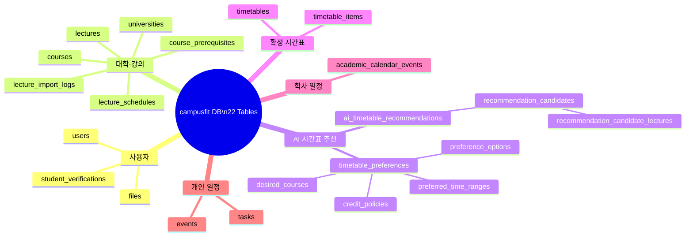

# CampusFit 시스템 다이어그램

---

## 1. ERD (Entity Relationship Diagram)

```mermaid
erDiagram

  users {
    BIGINT id PK
    VARCHAR email UK
    VARCHAR password_hash
    VARCHAR name
    VARCHAR status
    VARCHAR role
    TINYINT marketing_agree
    DATETIME created_at
    DATETIME updated_at
  }

  universities {
    BIGINT id PK
    VARCHAR name
    VARCHAR domain
    DATETIME created_at
  }

  files {
    BIGINT id PK
    VARCHAR original_name
    VARCHAR stored_path
    VARCHAR mime_type
    BIGINT size
    VARCHAR purpose
    BIGINT uploaded_by FK
    DATETIME created_at
  }

  student_verifications {
    BIGINT id PK
    BIGINT user_id FK
    BIGINT file_id FK
    VARCHAR verification_type
    VARCHAR status
    VARCHAR reject_reason
    BIGINT reviewed_by FK
    DATETIME created_at
    DATETIME updated_at
  }

  courses {
    BIGINT id PK
    BIGINT university_id FK
    VARCHAR name
    INT credits
    VARCHAR category
    BIGINT dept_id
    DATETIME created_at
  }

  course_prerequisites {
    BIGINT id PK
    BIGINT course_id FK
    BIGINT prerequisite_course_id FK
  }

  lectures {
    BIGINT id PK
    BIGINT course_id FK
    BIGINT university_id FK
    INT academic_year
    VARCHAR term_season
    VARCHAR professor
    VARCHAR room
    TINYINT is_remote
    VARCHAR dept
    INT target_grade
    VARCHAR lecture_number
    VARCHAR area
    VARCHAR campus
    DATETIME created_at
  }

  lecture_schedules {
    BIGINT id PK
    BIGINT lecture_id FK
    VARCHAR day_of_week
    TIME start_time
    TIME end_time
  }

  lecture_import_logs {
    BIGINT id PK
    BIGINT university_id
    INT year
    VARCHAR term_season
    VARCHAR file_name
    INT imported_count
    DATETIME imported_at
  }

  timetable_preferences {
    BIGINT id PK
    BIGINT user_id FK
    INT academic_year
    VARCHAR term_season
    DATETIME created_at
    DATETIME updated_at
  }

  preferred_time_ranges {
    BIGINT id PK
    BIGINT preference_id FK
    VARCHAR type
    VARCHAR day_of_week
    TIME start_time
    TIME end_time
  }

  desired_courses {
    BIGINT id PK
    BIGINT preference_id FK
    BIGINT course_id
    VARCHAR raw_text
    INT priority
  }

  credit_policies {
    BIGINT id PK
    BIGINT preference_id FK
    INT min_credits
    INT max_credits
    INT target_credits
    INT target_major_credits
    INT target_general_credits
    INT target_remote_credits
  }

  preference_options {
    BIGINT id PK
    BIGINT preference_id FK
    TINYINT exclude_morning
    INT allow_gaps_minutes
    INT max_days_per_week
    VARCHAR dept
    TINYINT prefer_major_only
    INT grade
  }

  ai_timetable_recommendations {
    BIGINT id PK
    BIGINT user_id FK
    INT year
    VARCHAR term_season
    TEXT request_params_json
    DATETIME created_at
  }

  recommendation_candidates {
    BIGINT id PK
    BIGINT recommendation_id FK
    INT rank
    INT total_credits
  }

  recommendation_candidate_lectures {
    BIGINT candidate_id FK
    BIGINT lecture_id FK
  }

  timetables {
    BIGINT id PK
    BIGINT user_id FK
    INT year
    VARCHAR term_season
    VARCHAR title
    VARCHAR status
    BIGINT source_recommendation_id
    DATETIME created_at
    DATETIME updated_at
  }

  timetable_items {
    BIGINT id PK
    BIGINT timetable_id FK
    BIGINT lecture_id FK
  }

  academic_calendar_events {
    BIGINT id PK
    BIGINT university_id FK
    VARCHAR title
    DATE start_date
    DATE end_date
    VARCHAR category
    INT year
    DATETIME created_at
  }

  events {
    BIGINT id PK
    BIGINT user_id FK
    VARCHAR title
    VARCHAR category
    DATETIME start_at
    DATETIME end_at
    TINYINT all_day
    VARCHAR description
    DATETIME remind_at
    VARCHAR color
    DATETIME created_at
  }

  tasks {
    BIGINT id PK
    BIGINT user_id FK
    VARCHAR title
    VARCHAR status
    DATE scheduled_date
    DATETIME due_at
    VARCHAR category
    BIGINT linked_event_id FK
    DATETIME created_at
  }

  users ||--o{ files                        : "uploads"
  users ||--o{ student_verifications        : "submits"
  users ||--o{ student_verifications        : "reviews"
  users ||--o{ timetable_preferences        : "has"
  users ||--o{ ai_timetable_recommendations : "requests"
  users ||--o{ timetables                   : "owns"
  users ||--o{ events                       : "creates"
  users ||--o{ tasks                        : "creates"

  universities ||--o{ courses                  : "offers"
  universities ||--o{ lectures                 : "holds"
  universities ||--o{ academic_calendar_events : "publishes"

  courses ||--o{ lectures             : "realized as"
  courses ||--o{ course_prerequisites : "requires"
  courses ||--o{ course_prerequisites : "is prerequisite of"

  lectures ||--o{ lecture_schedules                 : "has schedule"
  lectures ||--o{ recommendation_candidate_lectures : "included in"
  lectures ||--o{ timetable_items                   : "placed in"

  timetable_preferences ||--o{ preferred_time_ranges : "avoids/prefers"
  timetable_preferences ||--o{ desired_courses        : "wants"
  timetable_preferences ||--|| credit_policies        : "has"
  timetable_preferences ||--|| preference_options     : "has"

  ai_timetable_recommendations ||--o{ recommendation_candidates          : "generates"
  recommendation_candidates    ||--o{ recommendation_candidate_lectures  : "contains"

  timetables ||--o{ timetable_items : "contains"

  events ||--o{ tasks : "linked to"
  files  ||--|| student_verifications : "attached to"
```

---

## 2. DB 스키마 클래스 다이어그램

---

## 3. 백엔드 아키텍처 컴포넌트 다이어그램

---

## 4. 프론트엔드 컴포넌트 다이어그램

---

## 5. AI 추천 흐름 시퀀스 다이어그램

---

## 6. 인증 흐름 시퀀스 다이어그램

---

## 7. 시스템 배포 구성도

---

## 8. 테이블 그룹 마인드맵

